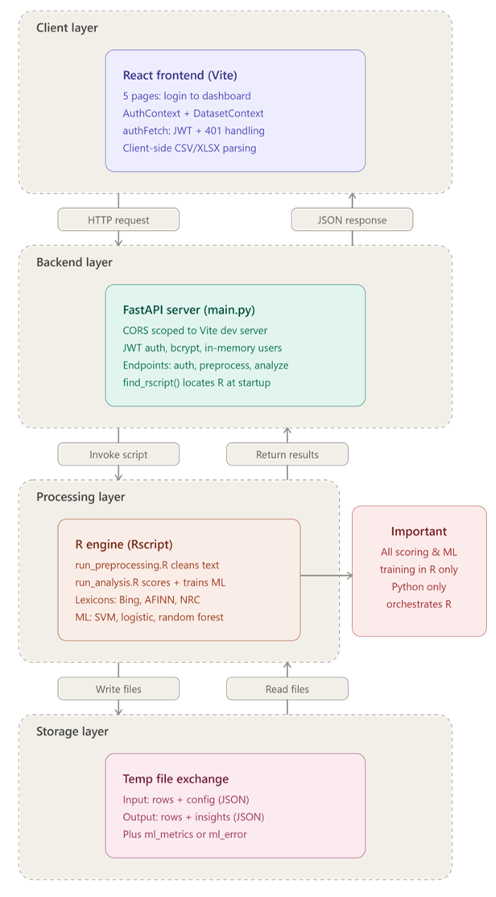
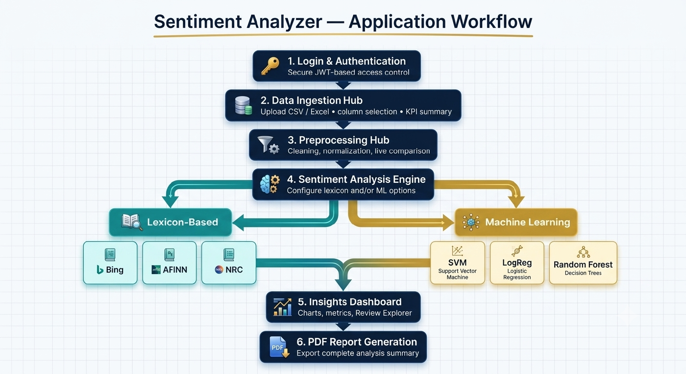

# Sentiment Analyzer

A web-based sentiment analysis platform that lets users upload a text dataset, clean it, run lexicon-based and machine-learning sentiment analysis, and explore the results — all without writing a single line of code.


## Table of Contents

- [Overview](#overview)
- [Features](#features)
- [Tech Stack](#tech-stack)
- [System Architecture](#system-architecture)
- [Application Workflow](#application-workflow)
- [Project Structure](#project-structure)
- [Getting Started](#getting-started)
- [Running the App](#running-the-app)
- [Demo Credentials](#demo-credentials)
- [API Reference](#api-reference)
- [Sentiment Lexicons & ML Models](#sentiment-lexicons--ml-models)

## Overview

Sentiment Analyzer guides a user through a structured, four-stage pipeline:

1. **Data Ingestion** — upload a CSV/Excel dataset, preview it, and pick the text (and optional label) column.
2. **Preprocessing** — clean the text with configurable options and preview the changes live.
3. **Sentiment Analysis** — score the text with one or more lexicons, and optionally train a machine learning model.
4. **Insights Dashboard** — explore charts, model performance metrics, a searchable review explorer, and export a PDF report.

The heavy lifting happens in a decoupled three-tier architecture: a React frontend for the UI, a FastAPI backend for orchestration and auth, and an R analysis engine for all text processing, sentiment scoring, and machine learning.

## Features

- Secure JWT-based login with protected routing
- CSV/Excel upload with client-side parsing (no large file ever touches the server)
- Automatic dataset KPIs: record count, detected language, missing values, column count
- Configurable text preprocessing: lowercasing, URL/HTML removal, stopword removal, punctuation removal, special character removal, number removal, with live before/after comparison
- Three sentiment lexicons: **Bing**, **AFINN**, **NRC**
- Three optional machine learning models: **Support Vector Machine (SVM)**, **Penalized Logistic Regression (LASSO)**, **Random Forest**
- Adjustable sentiment sensitivity threshold (Strict → Broad)
- Automatic label normalization (handles star ratings, booleans, positive/negative/neutral text, etc.)
- Interactive Insights Dashboard: sentiment distribution, word frequency, polarity histogram, emotion heatmap, key insights, and a review explorer
- One-click PDF report export (client-side, print-to-PDF)

## Tech Stack

| Layer | Technology |
|---|---|
| **Frontend** | React 19, React Router, Tailwind CSS, Vite, PapaParse (CSV), SheetJS (Excel) |
| **Backend** | FastAPI, python-jose (JWT), bcrypt, Uvicorn |
| **Analysis Engine** | R, `syuzhet` (lexicons), `tm` / `slam` (DTM), `LiblineaR` (SVM), `glmnet` (LASSO), `ranger` (Random Forest) |

## System Architecture



- **Client layer** — the React SPA (Vite) handles auth state, dataset state, JWT-aware fetches, and all client-side file parsing.
- **Backend layer** — FastAPI exposes auth, preprocessing, and analysis endpoints, and locates the local `Rscript` executable at startup.
- **Processing layer** — R scripts perform all lexicon scoring and ML training; Python never touches the analysis logic directly.
- **Storage layer** — no database. Each request is exchanged with R via temporary JSON files (input rows/config in, processed rows/insights/metrics out).

## Application Workflow



## Project Structure

```
Sentiment-Analysis/
├── backend/
│   ├── R/
│   │   ├── preprocessing_runner.R     # Entry point invoked by FastAPI for /api/preprocess
│   │   ├── preprocessing_page.R       # Text cleaning, normalization, missing-data handling
│   │   ├── analysis_runner.R          # Entry point invoked by FastAPI for /api/analyze
│   │   ├── analysis_page.R            # Lexicon scoring + ML dispatch
│   │   ├── analysis_ml_training.R     # SVM / LASSO / Random Forest training & evaluation
│   │   ├── dashboard_page.R           # Insights, word frequency, emotion heatmap data
│   │   └── utils.R                    # Shared helpers (label normalization, package installer)
│   ├── auth.py                        # JWT auth, bcrypt password hashing, user store
│   ├── main.py                        # FastAPI app and API routes
│   └── requirements.txt
├── frontend/
│   ├── src/
│   │   ├── components/                # Charts, review explorer, report modal, sidebar, etc.
│   │   ├── context/                   # AuthContext, DatasetContext (global app state)
│   │   ├── layouts/                   # MainLayout (protected shell)
│   │   ├── pages/                     # LoginPage, IngestionPage, PreprocessingPage, AnalysisPage, DashboardPage
│   │   └── utils/                     # authFetch wrapper (JWT header + 401 handling)
│   ├── index.html
│   ├── package.json
│   └── vite.config.js
├── docs/
│   └── images/                        # README assets
└── README.md
```

## Getting Started

### Prerequisites

- **Node.js** 16+ and npm
- **Python** 3.9+
- **R** 4.0+ with `Rscript` available on your `PATH` (or under a standard `Program Files\R\...` install on Windows)

Required R packages (`jsonlite`, `syuzhet`, `tm`, `NLP`, `slam`, `LiblineaR`, `glmnet`, `ranger`, `dplyr`, `stringr`) are installed automatically on first run if missing — no manual `install.packages()` step required.

### Install Dependencies

```bash
cd backend && pip install -r requirements.txt
cd ../frontend && npm install
```

## Running the App

Open two terminals:

```bash
# Terminal 1 — backend (http://localhost:8000)
cd backend
python -m uvicorn main:app --port 8000 --reload
```

```bash
# Terminal 2 — frontend (http://localhost:5173)
cd frontend
npm run dev
```

Open `http://localhost:5173` in your browser and log in to get started.

## Demo Credentials

Two accounts are seeded for local development in `backend/auth.py`:

| Username | Password | Role |
|---|---|---|
| `admin1` | `franca@15` | admin |
| `user1` | `space@15` | user |

> For any real deployment, replace the in-memory user store in `auth.py` and set a strong `SENTIMENT_APP_SECRET_KEY` environment variable (used to sign JWTs).

## API Reference

All endpoints except `/api/login` require a `Bearer` JWT in the `Authorization` header.

| Method | Endpoint | Description |
|---|---|---|
| `POST` | `/api/login` | Authenticate and receive a JWT access token |
| `GET`  | `/api/me` | Return the currently authenticated user |
| `POST` | `/api/preprocess` | Run the configured text preprocessing pipeline over the dataset |
| `POST` | `/api/analyze` | Run lexicon scoring (and optional ML training) over the dataset |

## Sentiment Lexicons & ML Models

| Method | Type | Library | Notes |
|---|---|---|---|
| Bing | Lexicon | `syuzhet` | Binary positive/negative word matching |
| AFINN | Lexicon | `syuzhet` | Word-level scores from -5 to +5 |
| NRC | Lexicon | `syuzhet` | 8 emotion categories + polarity |
| SVM | ML (supervised) | `LiblineaR` | Requires a label column; fast, high accuracy |
| Penalized Logistic Regression (LASSO) | ML (supervised) | `glmnet` | Requires a label column; built-in feature selection |
| Random Forest | ML (supervised) | `ranger` | Requires a label column; robust to noisy data |

ML models train on an 80/20 stratified split of the labelled rows and report Accuracy, Precision, Recall, and F1-Score on the held-out test set.
